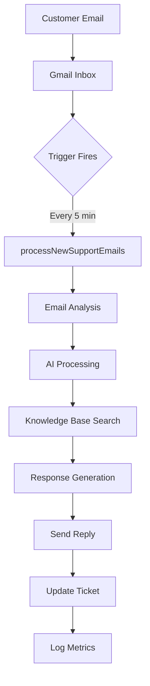

# 🔬 Technical Deep Dive: Gmail Support System

## From Zero to Hero - How Everything Works Under the Hood

This document provides a complete technical walkthrough of how the Gmail Support System operates, from the first email arrival to the final AI-powered response.

## Table of Contents
1. [System Overview](#system-overview)
2. [Core Architecture](#core-architecture)
3. [Email Processing Pipeline](#email-processing-pipeline)
4. [AI Integration Deep Dive](#ai-integration-deep-dive)
5. [Data Flow & State Management](#data-flow--state-management)
6. [Service Layer Architecture](#service-layer-architecture)
7. [Performance Optimizations](#performance-optimizations)
8. [Security Implementation](#security-implementation)
9. [Scaling Considerations](#scaling-considerations)
10. [Debugging & Monitoring](#debugging--monitoring)

## System Overview

### What Happens When an Email Arrives?



### The Magic Behind the Scenes

When a customer sends an email to your Gmail address, here's the complete journey:

## Core Architecture

### 1. Entry Points

The system has multiple entry points, but the main one is the time-driven trigger:

```javascript
// Code.gs - Main entry point
function processNewSupportEmails() {
  const startTime = new Date();
  
  try {
    // Check if we're in business hours
    if (!isBusinessHours()) {
      console.log('Outside business hours - skipping');
      return;
    }
    
    // Search for unprocessed support emails
    const threads = EmailService.searchEmails({
      query: 'is:unread label:Support -label:AI-Processing',
      limit: ConfigService.get('email.maxBatchSize', 10)
    });
    
    // Process each thread
    threads.forEach(thread => {
      processSupportThread(thread);
    });
    
  } catch (error) {
    ErrorService.handleError(error, {
      context: 'processNewSupportEmails',
      severity: 'critical'
    });
  }
}
```

### 2. Thread Processing Pipeline

Each email thread goes through a sophisticated pipeline:

```javascript
function processSupportThread(thread) {
  // Step 1: Lock the thread to prevent double processing
  const lockService = LockService.getScriptLock();
  const hasLock = lockService.tryLock(1000);
  
  if (!hasLock) {
    console.log('Thread locked by another process');
    return;
  }
  
  try {
    // Step 2: Apply processing label
    thread.addLabel(GmailApp.getUserLabelByName('AI-Processing'));
    
    // Step 3: Extract email data
    const messages = thread.getMessages();
    const latestMessage = messages[messages.length - 1];
    const email = extractEmailData(latestMessage);
    
    // Step 4: Check for loops
    if (LoopPreventionService.isLoop(email)) {
      console.log('Email loop detected - skipping');
      thread.addLabel(GmailApp.getUserLabelByName('Loop-Detected'));
      return;
    }
    
    // Step 5: Create or update ticket
    const ticket = TicketService.createOrUpdateTicket(email);
    
    // Step 6: AI Analysis
    const analysis = AIService.analyzeEmail(email);
    
    // Step 7: Knowledge Base Search
    const kbArticles = KnowledgeBaseService.search(
      analysis.searchQuery || email.subject,
      { limit: 5 }
    );
    
    // Step 8: Generate Response
    const response = AutoReplyService.generateResponse({
      email: email,
      analysis: analysis,
      knowledgeArticles: kbArticles,
      ticket: ticket
    });
    
    // Step 9: Send Reply
    if (response.confidence > 0.8) {
      EmailService.sendReply(thread, response.content);
      thread.addLabel(GmailApp.getUserLabelByName('AI-Processed'));
    } else {
      // Escalate to human
      EscalationService.escalate(ticket, 'Low AI confidence');
      thread.addLabel(GmailApp.getUserLabelByName('Needs-Human'));
    }
    
    // Step 10: Update metrics
    MetricsService.recordProcessing({
      ticketId: ticket.id,
      processingTime: new Date() - startTime,
      aiConfidence: response.confidence,
      resolved: response.confidence > 0.8
    });
    
  } finally {
    lockService.releaseLock();
  }
}
```

## Email Processing Pipeline

### Stage 1: Email Detection

The system uses Gmail's powerful search operators to find support emails:

```javascript
// EmailService.gs
static searchEmails(params) {
  const {
    query = '',
    label = null,
    limit = 10,
    excludeLabels = []
  } = params;
  
  // Build search query
  let searchQuery = query;
  
  if (label) {
    searchQuery += ` label:${label}`;
  }
  
  excludeLabels.forEach(excludeLabel => {
    searchQuery += ` -label:${excludeLabel}`;
  });
  
  // Add default filters
  searchQuery += ' -in:trash -in:spam';
  
  // Execute search with caching
  const cacheKey = `email_search_${Utilities.base64Encode(searchQuery)}`;
  const cached = CacheService.getScriptCache().get(cacheKey);
  
  if (cached) {
    return JSON.parse(cached);
  }
  
  const threads = GmailApp.search(searchQuery, 0, limit);
  
  // Cache for 1 minute
  CacheService.getScriptCache().put(
    cacheKey,
    JSON.stringify(threads.map(t => t.getId())),
    60
  );
  
  return threads;
}
```

### Stage 2: Email Parsing

Converting Gmail messages to structured data:

```javascript
function extractEmailData(message) {
  const attachments = message.getAttachments();
  
  return {
    id: message.getId(),
    threadId: message.getThread().getId(),
    from: message.getFrom(),
    to: message.getTo(),
    cc: message.getCc(),
    subject: message.getSubject(),
    body: message.getPlainBody(),
    htmlBody: message.getBody(),
    date: message.getDate(),
    labels: message.getThread().getLabels().map(l => l.getName()),
    attachments: attachments.map(a => ({
      name: a.getName(),
      type: a.getContentType(),
      size: a.getSize()
    })),
    headers: {
      messageId: getHeader(message, 'Message-ID'),
      inReplyTo: getHeader(message, 'In-Reply-To'),
      references: getHeader(message, 'References')
    }
  };
}
```

## AI Integration Deep Dive

### The Gemini API Integration

The AI Service is the brain of the operation:

```javascript
// AIService.gs
class AIService {
  static analyzeEmail(email, options = {}) {
    const prompt = this.buildAnalysisPrompt(email);
    
    const payload = {
      contents: [{
        parts: [{
          text: prompt
        }]
      }],
      generationConfig: {
        temperature: 0.7,
        topK: 1,
        topP: 1,
        maxOutputTokens: 2048,
      }
    };
    
    const response = UrlFetchApp.fetch(
      `https://generativelanguage.googleapis.com/v1beta/models/gemini-1.5-flash:generateContent?key=${this.apiKey}`,
      {
        method: 'post',
        contentType: 'application/json',
        payload: JSON.stringify(payload)
      }
    );
    
    const result = JSON.parse(response.getContentText());
    return this.parseAnalysisResult(result);
  }
  
  static buildAnalysisPrompt(email) {
    return `
      Analyze this customer support email and provide structured data:
      
      From: ${email.from}
      Subject: ${email.subject}
      Body: ${email.body}
      
      Return a JSON object with:
      {
        "category": "technical|billing|general|feedback",
        "sentiment": "positive|neutral|negative",
        "urgency": 0-1 score,
        "intent": "primary customer intent",
        "entities": ["extracted", "entities"],
        "suggestedActions": ["action1", "action2"],
        "searchQuery": "optimized search query for knowledge base",
        "language": "detected language code",
        "summary": "brief summary of the issue"
      }
    `;
  }
}
```

### Response Generation with Context

The system generates contextual responses using knowledge base articles:

```javascript
static generateResponse({ email, analysis, knowledgeArticles, ticket }) {
  const context = {
    customerHistory: this.getCustomerHistory(email.from),
    previousTickets: this.getRelatedTickets(email.from, analysis.category),
    businessInfo: this.getBusinessContext()
  };
  
  const prompt = `
    Generate a helpful support response for this email:
    
    Customer Email: ${email.body}
    
    Analysis:
    - Category: ${analysis.category}
    - Sentiment: ${analysis.sentiment}
    - Intent: ${analysis.intent}
    
    Relevant Knowledge Base Articles:
    ${knowledgeArticles.map(article => 
      `- ${article.title}: ${article.summary}`
    ).join('\n')}
    
    Customer Context:
    - Previous tickets: ${context.previousTickets.length}
    - Customer since: ${context.customerHistory.firstContact}
    - Language preference: ${analysis.language}
    
    Guidelines:
    1. Be helpful and empathetic
    2. Use information from knowledge base articles
    3. Keep response concise and actionable
    4. Match the customer's language
    5. Include relevant links or resources
    6. Sign off professionally
    
    Generate the response:
  `;
  
  const response = this.callGeminiAPI(prompt);
  
  return {
    content: response.text,
    confidence: response.confidence,
    suggestedFollowUp: response.followUp,
    resources: response.resources
  };
}
```

## Data Flow & State Management

### Ticket Lifecycle

```javascript
// TicketService.gs
class TicketService {
  static createTicket(email, metadata = {}) {
    const ticketId = this.generateTicketId();
    
    const ticket = {
      id: ticketId,
      threadId: email.threadId,
      customerEmail: this.extractCustomerEmail(email.from),
      subject: email.subject,
      description: email.body,
      status: 'new',
      priority: metadata.priority || 'medium',
      category: metadata.category || 'general',
      
      // Timestamps
      createdAt: new Date(),
      updatedAt: new Date(),
      firstResponseAt: null,
      resolvedAt: null,
      
      // SLA tracking
      sla: this.calculateSLA(metadata.priority),
      
      // Assignment
      assignedTo: null,
      assignedAt: null,
      
      // History
      history: [{
        timestamp: new Date(),
        action: 'created',
        user: 'system',
        details: { source: 'email' }
      }]
    };
    
    // Store in cache and properties
    this.saveTicket(ticket);
    
    // Create calendar event for SLA
    this.createSLAReminder(ticket);
    
    return ticket;
  }
  
  static calculateSLA(priority) {
    const now = new Date();
    const config = ConfigService.get(`sla.${priority}`);
    
    return {
      responseTarget: new Date(now.getTime() + config.response * 60000),
      resolutionTarget: new Date(now.getTime() + config.resolution * 60000),
      breached: false
    };
  }
}
```

### State Storage Strategy

The system uses multiple storage layers:

```javascript
// Storage layers from fastest to slowest
1. Script Cache (6 hours max)     - Hot data
2. Document Properties            - Warm data  
3. Script Properties             - Configuration
4. Google Sheets                 - Persistent data
5. Google Drive                  - Archives

// Example: Ticket storage
static saveTicket(ticket) {
  // Layer 1: Cache for fast access
  const cache = CacheService.getScriptCache();
  cache.put(
    `ticket_${ticket.id}`,
    JSON.stringify(ticket),
    21600 // 6 hours
  );
  
  // Layer 2: Document properties for session
  const docProps = PropertiesService.getDocumentProperties();
  docProps.setProperty(
    `ticket_${ticket.id}`,
    JSON.stringify(ticket)
  );
  
  // Layer 3: Append to sheet for persistence
  const sheet = SpreadsheetApp.openById(CONFIG.ticketSheetId);
  sheet.appendRow([
    ticket.id,
    ticket.customerEmail,
    ticket.subject,
    ticket.status,
    ticket.priority,
    ticket.createdAt,
    JSON.stringify(ticket)
  ]);
}
```

## Service Layer Architecture

### Service Communication Pattern

Services communicate through a clean interface pattern:

```javascript
// Service Interface Pattern
class BaseService {
  static init() {
    this.cache = CacheService.getScriptCache();
    this.props = PropertiesService.getScriptProperties();
    this.config = ConfigService.getAll();
  }
  
  static withErrorHandling(fn) {
    return (...args) => {
      try {
        return fn.apply(this, args);
      } catch (error) {
        ErrorService.handleError(error, {
          service: this.name,
          method: fn.name,
          args: args
        });
        throw error;
      }
    };
  }
  
  static withCaching(fn, ttl = 300) {
    return (...args) => {
      const cacheKey = `${this.name}_${fn.name}_${JSON.stringify(args)}`;
      const cached = this.cache.get(cacheKey);
      
      if (cached) {
        return JSON.parse(cached);
      }
      
      const result = fn.apply(this, args);
      this.cache.put(cacheKey, JSON.stringify(result), ttl);
      
      return result;
    };
  }
}
```

### Service Dependency Graph

```
┌─────────────────────────────────────────────────────────┐
│                     Code.gs (Orchestrator)               │
└────────────────────────┬────────────────────────────────┘
                         │
    ┌────────────────────┼────────────────────┐
    │                    │                    │
┌───▼──────┐     ┌──────▼──────┐     ┌──────▼──────┐
│ConfigService│   │EmailService │     │DebugService │
└───┬──────┘     └──────┬──────┘     └──────┬──────┘
    │                    │                    │
    └────────┬───────────┴───────────────────┘
             │
    ┌────────┼────────────────────────────┐
    │        │        │         │         │
┌───▼──┐ ┌──▼───┐ ┌──▼───┐ ┌──▼───┐ ┌──▼────┐
│ AI   │ │ KB   │ │Ticket│ │Metric│ │Error  │
│Service│ │Service│ │Service│ │Service│ │Service│
└──────┘ └──────┘ └──────┘ └──────┘ └───────┘
```

## Performance Optimizations

### 1. Batch Processing

```javascript
// Process emails in batches to avoid timeouts
function processEmailBatch(threads, batchSize = 5) {
  const batches = [];
  
  for (let i = 0; i < threads.length; i += batchSize) {
    batches.push(threads.slice(i, i + batchSize));
  }
  
  batches.forEach((batch, index) => {
    // Process batch with delay to avoid rate limits
    Utilities.sleep(index * 1000);
    
    batch.forEach(thread => {
      try {
        processSupportThread(thread);
      } catch (error) {
        console.error(`Failed to process thread: ${error}`);
      }
    });
  });
}
```

### 2. Caching Strategy

```javascript
class CacheManager {
  static multilevelCache = {
    // L1: In-memory cache (per execution)
    memory: new Map(),
    
    // L2: Script cache (cross-execution)
    script: CacheService.getScriptCache(),
    
    // L3: Document properties (persistent)
    document: PropertiesService.getDocumentProperties()
  };
  
  static get(key) {
    // Check L1
    if (this.multilevelCache.memory.has(key)) {
      return this.multilevelCache.memory.get(key);
    }
    
    // Check L2
    const l2Value = this.multilevelCache.script.get(key);
    if (l2Value) {
      this.multilevelCache.memory.set(key, l2Value);
      return JSON.parse(l2Value);
    }
    
    // Check L3
    const l3Value = this.multilevelCache.document.getProperty(key);
    if (l3Value) {
      // Promote to L2 and L1
      this.multilevelCache.script.put(key, l3Value, 3600);
      this.multilevelCache.memory.set(key, JSON.parse(l3Value));
      return JSON.parse(l3Value);
    }
    
    return null;
  }
}
```

### 3. Lazy Loading

```javascript
// Load services only when needed
const ServiceLoader = {
  _services: {},
  
  get(serviceName) {
    if (!this._services[serviceName]) {
      switch(serviceName) {
        case 'AI':
          this._services[serviceName] = AIService;
          break;
        case 'KB':
          this._services[serviceName] = KnowledgeBaseService;
          break;
        // ... other services
      }
      
      // Initialize service
      if (this._services[serviceName].init) {
        this._services[serviceName].init();
      }
    }
    
    return this._services[serviceName];
  }
};
```

## Security Implementation

### 1. API Key Management

```javascript
class SecurityService {
  static getAPIKey(service) {
    // Never hardcode keys
    const encryptedKey = PropertiesService.getScriptProperties()
      .getProperty(`${service}_API_KEY`);
    
    if (!encryptedKey) {
      throw new Error(`API key for ${service} not found`);
    }
    
    // In production, implement proper decryption
    return this.decrypt(encryptedKey);
  }
  
  static sanitizeUserInput(input) {
    // Remove potential script injection
    return input
      .replace(/<script.*?>/gi, '')
      .replace(/<\/script>/gi, '')
      .replace(/javascript:/gi, '')
      .replace(/on\w+=/gi, '');
  }
  
  static validateEmail(email) {
    const regex = /^[^\s@]+@[^\s@]+\.[^\s@]+$/;
    return regex.test(email);
  }
}
```

### 2. Rate Limiting

```javascript
class RateLimiter {
  static checkLimit(action, identifier, maxAttempts = 10, windowMinutes = 60) {
    const key = `rate_limit_${action}_${identifier}`;
    const now = new Date().getTime();
    const window = windowMinutes * 60 * 1000;
    
    // Get existing attempts
    const attemptsData = CacheService.getScriptCache().get(key);
    let attempts = attemptsData ? JSON.parse(attemptsData) : [];
    
    // Filter attempts within window
    attempts = attempts.filter(timestamp => now - timestamp < window);
    
    if (attempts.length >= maxAttempts) {
      throw new Error(`Rate limit exceeded for ${action}`);
    }
    
    // Add current attempt
    attempts.push(now);
    CacheService.getScriptCache().put(key, JSON.stringify(attempts), window / 1000);
    
    return true;
  }
}
```

## Scaling Considerations

### 1. Quota Management

```javascript
class QuotaManager {
  static quotas = {
    gmailRead: { limit: 20000, period: 'day' },
    gmailSend: { limit: 1500, period: 'day' },
    urlFetch: { limit: 20000, period: 'day' },
    triggerTotal: { limit: 20, period: 'project' },
    executionTime: { limit: 360, period: 'execution' },
    triggers: { limit: 20, period: 'script' }
  };
  
  static checkQuota(service) {
    const usage = this.getUsage(service);
    const quota = this.quotas[service];
    
    if (usage >= quota.limit * 0.8) {
      console.warn(`Approaching quota limit for ${service}: ${usage}/${quota.limit}`);
      
      // Implement backoff strategy
      const backoffMinutes = Math.pow(2, Math.floor(usage / quota.limit * 10));
      Utilities.sleep(backoffMinutes * 60 * 1000);
    }
    
    return usage < quota.limit;
  }
}
```

### 2. Horizontal Scaling

```javascript
// Distribute load across multiple scripts
class LoadBalancer {
  static scripts = [
    'SCRIPT_ID_1',
    'SCRIPT_ID_2',
    'SCRIPT_ID_3'
  ];
  
  static distribute(workload) {
    const chunks = this.chunkWorkload(workload, this.scripts.length);
    
    chunks.forEach((chunk, index) => {
      const scriptId = this.scripts[index];
      
      // Call other script asynchronously
      UrlFetchApp.fetch(
        `https://script.google.com/macros/s/${scriptId}/exec`,
        {
          method: 'post',
          payload: JSON.stringify({
            action: 'processChunk',
            data: chunk
          }),
          muteHttpExceptions: true
        }
      );
    });
  }
}
```

## Debugging & Monitoring

### 1. Debug Service Implementation

```javascript
class DebugService {
  static debugMode = false;
  static logs = [];
  
  static log(message, data = null, level = 'info') {
    if (!this.debugMode && level !== 'error') return;
    
    const entry = {
      timestamp: new Date().toISOString(),
      level: level,
      message: message,
      data: data,
      stack: new Error().stack
    };
    
    // Multi-destination logging
    console.log(`[${level.toUpperCase()}] ${message}`, data);
    this.logs.push(entry);
    
    // Send to external logging service
    if (level === 'error') {
      this.sendToLoggingService(entry);
    }
  }
  
  static profile(operation, fn) {
    const start = new Date().getTime();
    const result = fn();
    const duration = new Date().getTime() - start;
    
    this.log(`Performance: ${operation}`, { duration }, 'debug');
    
    // Alert if operation is slow
    if (duration > 1000) {
      this.log(`Slow operation detected: ${operation}`, { duration }, 'warn');
    }
    
    return result;
  }
}
```

### 2. Health Monitoring

```javascript
class HealthMonitor {
  static checks = {
    gmail: () => {
      try {
        GmailApp.getInboxThreads(0, 1);
        return { status: 'healthy', latency: 0 };
      } catch (error) {
        return { status: 'unhealthy', error: error.message };
      }
    },
    
    ai: async () => {
      const start = Date.now();
      try {
        await AIService.ping();
        return { status: 'healthy', latency: Date.now() - start };
      } catch (error) {
        return { status: 'unhealthy', error: error.message };
      }
    },
    
    storage: () => {
      try {
        const props = PropertiesService.getScriptProperties();
        props.setProperty('health_check', new Date().toISOString());
        return { status: 'healthy' };
      } catch (error) {
        return { status: 'unhealthy', error: error.message };
      }
    }
  };
  
  static runHealthCheck() {
    const results = {};
    
    Object.entries(this.checks).forEach(([service, check]) => {
      results[service] = check();
    });
    
    // Store results
    const healthy = Object.values(results).every(r => r.status === 'healthy');
    
    if (!healthy) {
      // Send alert
      this.sendHealthAlert(results);
    }
    
    return results;
  }
}
```

## Prompt Customization System

### Complete Control Over AI Behavior

The system includes a powerful prompt configuration service that allows you to:
- **Edit** any AI prompt directly through a visual editor
- **Override** default prompts with your custom versions
- **Extend** prompts by adding additional instructions
- **Version** prompts with automatic backup history
- **Test** prompts with sample data before deploying

### Accessing the Prompt Editor

```javascript
// From Google Sheets menu
function onOpen() {
  SpreadsheetApp.getUi()
    .createMenu('Gmail Support')
    .addItem('Edit AI Prompts', 'openPromptEditor')
    .addToUi();
}
```

### Available Prompts for Customization

1. **Email Analysis** (`prompt.email.analysis`)
   - Controls how emails are analyzed
   - Customize categories, urgency detection, entity extraction

2. **Response Generation** (`prompt.response.generation`)
   - Controls AI response style and content
   - Customize tone, length, formatting

3. **Categorization** (`prompt.categorization`)
   - Define custom categories for your business
   - Add industry-specific classifications

4. **Sentiment Analysis** (`prompt.sentiment`)
   - Adjust sentiment detection sensitivity
   - Add custom emotional states

5. **Urgency Detection** (`prompt.urgency`)
   - Define what constitutes urgent for your business
   - Add custom urgency triggers

### Customization Examples

#### Example 1: Industry-Specific Language
```javascript
// For healthcare industry
PromptConfigService.extendPrompt(
  PromptConfigService.PROMPT_KEYS.RESPONSE_GENERATION,
  `
  Healthcare Compliance:
  - Use HIPAA-compliant language
  - Never mention specific medical conditions in examples
  - Include privacy notice in signature
  - Reference case ID instead of personal details
  `,
  'Additional Instructions:'
);
```

#### Example 2: Custom Categories
```javascript
// Replace default categories
PromptConfigService.setPrompt(
  PromptConfigService.PROMPT_KEYS.CATEGORIZATION,
  `
  Categorize this email into one of these departments:
  
  Email: {{email.subject}} - {{email.body}}
  
  Categories:
  - hardware-repair: Physical device issues
  - software-bug: Application errors and crashes  
  - network-issue: Connectivity problems
  - account-access: Login and permission issues
  - data-request: Data export or deletion requests
  - training-request: User training needs
  
  Consider the primary issue and required expertise.
  Return only the category slug.
  `
);
```

#### Example 3: Multi-Language Support
```javascript
// Add language-specific response generation
const languagePrompts = {
  'es': 'Responde en español con un tono profesional pero amigable...',
  'fr': 'Répondez en français avec un ton professionnel mais amical...',
  'de': 'Antworten Sie auf Deutsch in einem professionellen, aber freundlichen Ton...'
};

// Extend prompt based on detected language
if (analysis.language !== 'en') {
  PromptConfigService.extendPrompt(
    PromptConfigService.PROMPT_KEYS.RESPONSE_GENERATION,
    languagePrompts[analysis.language] || '',
    'Response Guidelines:'
  );
}
```

### Variable System

The prompt system supports Handlebars-like templating:

```javascript
// Simple variables
{{email.subject}}
{{customer.name}}
{{analysis.category}}

// Nested properties
{{customer.history.lastContact}}
{{ticket.sla.responseTarget}}

// Conditional blocks
{{#if customer.vip}}
  Priority handling for VIP customer
{{/if}}

// Loops
{{#each knowledgeArticles}}
  - {{this.title}}: {{this.summary}}
{{/each}}
```

### Programmatic Prompt Management

```javascript
// Get current prompt with variables
const prompt = PromptConfigService.getPrompt(
  PromptConfigService.PROMPT_KEYS.EMAIL_ANALYSIS,
  {
    email: emailData,
    customer: customerData,
    context: additionalContext
  }
);

// Override a prompt completely
PromptConfigService.setPrompt(
  'prompt.email.analysis',
  'Your completely custom prompt here...'
);

// Extend existing prompt
PromptConfigService.extendPrompt(
  'prompt.response.generation',
  'Always mention our 24/7 support availability.',
  'end' // or 'start' or specific text to insert after
);

// Reset to default
PromptConfigService.resetPrompt('prompt.email.analysis');

// Export all prompts for backup
const backup = PromptConfigService.exportPrompts();

// Import prompts from backup
PromptConfigService.importPrompts(backup);
```

### Best Practices for Prompt Customization

1. **Test Before Deploy**: Always test prompts with sample data
2. **Version Control**: The system auto-backs up the last 5 versions
3. **Clear Instructions**: Be specific about format and structure
4. **Use Examples**: Include examples in prompts for better results
5. **Iterate**: Monitor AI responses and refine prompts

### Monitoring Prompt Performance

```javascript
// Track prompt effectiveness
class PromptMetrics {
  static trackResponse(promptKey, response, feedback) {
    const metrics = {
      promptKey: promptKey,
      confidence: response.confidence,
      customerSatisfaction: feedback.rating,
      resolved: feedback.resolved,
      timestamp: new Date()
    };
    
    // Store metrics for analysis
    this.storeMetrics(metrics);
    
    // Auto-adjust prompts based on performance
    if (metrics.customerSatisfaction < 3) {
      console.log(`Low satisfaction for ${promptKey}, consider revision`);
    }
  }
}
```

## Advanced Features

### 1. Machine Learning Feedback Loop

```javascript
class MLFeedbackLoop {
  static recordFeedback(ticketId, feedback) {
    const ticket = TicketService.getTicket(ticketId);
    const trainingData = {
      input: ticket.description,
      category: ticket.category,
      response: ticket.resolution,
      feedback: feedback,
      timestamp: new Date()
    };
    
    // Store for model improvement
    this.appendToTrainingData(trainingData);
    
    // Update confidence thresholds
    if (feedback.rating < 3) {
      this.adjustConfidenceThreshold(ticket.category, -0.05);
    } else if (feedback.rating >= 4) {
      this.adjustConfidenceThreshold(ticket.category, 0.02);
    }
  }
}
```

### 2. Predictive SLA Management

```javascript
class PredictiveSLA {
  static predictBreachRisk(ticket) {
    const factors = {
      category: this.getCategoryAverageTime(ticket.category),
      customerHistory: this.getCustomerComplexity(ticket.customerEmail),
      currentLoad: this.getCurrentSystemLoad(),
      timeOfDay: this.getTimeOfDayFactor(),
      complexity: this.analyzeComplexity(ticket.description)
    };
    
    const predictedResolutionTime = 
      factors.category * 
      factors.customerHistory * 
      factors.currentLoad * 
      factors.timeOfDay * 
      factors.complexity;
    
    const breachRisk = predictedResolutionTime / ticket.sla.resolutionTarget;
    
    if (breachRisk > 0.8) {
      // Proactive escalation
      EscalationService.escalate(ticket, 'High SLA breach risk');
    }
    
    return breachRisk;
  }
}
```

## Conclusion

This Gmail Support System is a sophisticated, production-ready solution that leverages:

1. **Event-Driven Architecture** - Triggers process emails asynchronously
2. **Service-Oriented Design** - Modular services with clear boundaries
3. **Multi-Layer Caching** - Optimized performance with intelligent caching
4. **AI-First Approach** - Gemini API for intelligent processing
5. **Robust Error Handling** - Graceful degradation and recovery
6. **Security Best Practices** - API key encryption, input sanitization
7. **Scalability Patterns** - Quota management, load distribution
8. **Comprehensive Monitoring** - Health checks, performance profiling

The system processes emails efficiently, maintains state reliably, and scales gracefully within Google Apps Script's constraints. It's a testament to what can be achieved with "just" Apps Script when properly architected.

## Next Steps

To extend this system:

1. **Add more AI providers** - OpenAI, Anthropic, etc.
2. **Implement webhooks** - Real-time notifications
3. **Add voice support** - Phone integration
4. **Create mobile app** - Native notifications
5. **Build analytics dashboard** - Advanced insights

The foundation is solid and ready for any enhancements you need!