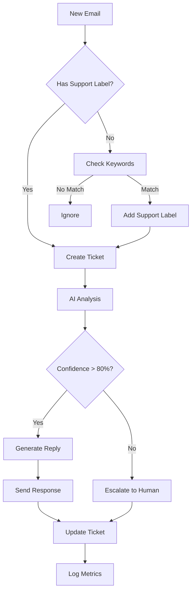

# 📚 Technical Documentation - Gmail Support System

## 🏗️ System Architecture

### Overview
The Gmail Support System is a **100% Google Apps Script** solution that transforms Gmail into an intelligent support desk. It uses a modular, service-oriented architecture with clear separation of concerns.

### Core Components

```
┌─────────────────┐     ┌─────────────────┐     ┌─────────────────┐
│                 │     │                 │     │                 │
│   Gmail API     │────▶│  Core Engine    │────▶│   AI Service    │
│                 │     │   (Code.gs)     │     │  (Gemini API)  │
└─────────────────┘     └────────┬────────┘     └─────────────────┘
                                 │
                    ┌────────────┼────────────┐
                    │            │            │
              ┌─────▼─────┐ ┌───▼────┐ ┌─────▼─────┐
              │  Ticket   │ │   KB   │ │   Loop    │
              │  Service  │ │Service │ │Prevention │
              └───────────┘ └────────┘ └───────────┘
```

## 📦 Service Documentation

### ConfigService
**Purpose**: Centralized configuration management

```javascript
/**
 * @class ConfigService
 * @description Manages all system configuration with environment support
 */
class ConfigService {
  /**
   * Get configuration value
   * @param {string} path - Dot notation path (e.g., 'ai.model')
   * @param {*} defaultValue - Default if not found
   * @returns {*} Configuration value
   */
  static get(path, defaultValue)
  
  /**
   * Set configuration value
   * @param {string} path - Dot notation path
   * @param {*} value - Value to set
   */
  static set(path, value)
  
  /**
   * Get full config object
   * @returns {Object} Complete configuration
   */
  static getAll()
}
```

### EmailService
**Purpose**: Gmail operations wrapper with rate limiting

```javascript
/**
 * @class EmailService
 * @description Handles all Gmail operations with caching and rate limiting
 */
class EmailService {
  /**
   * Search for emails
   * @param {Object} params - Search parameters
   * @param {string} params.query - Gmail search query
   * @param {string} params.label - Label to filter
   * @param {number} params.limit - Max results
   * @returns {GmailThread[]} Email threads
   */
  static searchEmails(params)
  
  /**
   * Send email with tracking
   * @param {string} to - Recipient email
   * @param {string} subject - Email subject
   * @param {string} body - Email body (HTML)
   * @param {Object} options - Additional options
   * @returns {GmailMessage} Sent message
   */
  static sendEmail(to, subject, body, options)
  
  /**
   * Apply labels to thread
   * @param {GmailThread} thread - Email thread
   * @param {string[]} labels - Labels to apply
   */
  static applyLabels(thread, labels)
}
```

### AIService
**Purpose**: Gemini AI integration

```javascript
/**
 * @class AIService
 * @description Google Gemini AI integration for email analysis and generation
 */
class AIService {
  /**
   * Analyze email content
   * @param {Object} email - Email object
   * @param {Object} options - Analysis options
   * @returns {Object} Analysis results
   * @returns {string} returns.category - Email category
   * @returns {string} returns.sentiment - Sentiment (positive/neutral/negative)
   * @returns {number} returns.urgency - Urgency score (0-1)
   * @returns {string[]} returns.entities - Extracted entities
   */
  static analyzeEmail(email, options)
  
  /**
   * Generate reply
   * @param {Object} email - Original email
   * @param {Object} context - Reply context
   * @param {Object[]} context.knowledgeArticles - Relevant KB articles
   * @param {string} context.tone - Reply tone
   * @returns {Object} Generated reply
   * @returns {string} returns.reply - Reply text
   * @returns {number} returns.confidence - Confidence score
   */
  static generateReply(email, context)
  
  /**
   * Detect language
   * @param {string} text - Text to analyze
   * @returns {string} ISO language code
   */
  static detectLanguage(text)
}
```

### KnowledgeBaseService
**Purpose**: Multi-source knowledge base management

```javascript
/**
 * @class KnowledgeBaseService
 * @description Searches across multiple knowledge sources
 */
class KnowledgeBaseService {
  /**
   * Search knowledge base
   * @param {string} query - Search query
   * @param {Object} options - Search options
   * @param {number} options.limit - Max results
   * @param {string[]} options.sources - Source IDs to search
   * @returns {Object[]} Search results
   */
  search(query, options)
  
  /**
   * Add knowledge source
   * @param {Object} source - Source configuration
   * @param {string} source.type - Source type (sheets/api/github/notion)
   * @param {string} source.id - Unique identifier
   * @param {Object} source.config - Type-specific config
   */
  addSource(source)
  
  /**
   * Sync knowledge base
   * @param {string} sourceId - Source to sync
   * @returns {Object} Sync results
   */
  syncSource(sourceId)
}
```

### TicketService
**Purpose**: Ticket lifecycle management

```javascript
/**
 * @class TicketService
 * @description Manages support ticket lifecycle
 */
class TicketService {
  /**
   * Create ticket from email
   * @param {Object} email - Email object
   * @param {Object} metadata - Additional metadata
   * @returns {Ticket} Created ticket
   */
  static createTicket(email, metadata)
  
  /**
   * Update ticket
   * @param {string} ticketId - Ticket ID
   * @param {Object} updates - Fields to update
   * @param {string} updatedBy - User/system making update
   * @returns {Ticket} Updated ticket
   */
  static updateTicket(ticketId, updates, updatedBy)
  
  /**
   * Search tickets
   * @param {string} query - Search query
   * @param {Object} filters - Filter options
   * @returns {Object} Search results
   */
  static searchTickets(query, filters)
  
  /**
   * Get ticket metrics
   * @param {string} ticketId - Ticket ID
   * @returns {Object} Ticket metrics
   */
  static getMetrics(ticketId)
}
```

## 🔄 Data Flow

### Email Processing Flow



## 🗄️ Data Models

### Ticket Schema

```javascript
{
  id: string,              // Unique identifier (TICKET-YYYYMMDD-XXXX)
  threadId: string,        // Gmail thread ID
  customerEmail: string,   // Customer email address
  subject: string,         // Email subject
  description: string,     // Email body
  category: string,        // technical|billing|general|feedback
  priority: string,        // urgent|high|medium|low
  status: string,          // new|open|pending|resolved|closed
  assignedTo: string?,     // Assigned user email
  
  // AI Analysis
  analysis: {
    sentiment: string,     // positive|neutral|negative
    urgency: number,       // 0-1 score
    entities: string[],    // Extracted entities
    suggestedActions: string[]
  },
  
  // Metrics
  metrics: {
    responseTime: number?, // Minutes to first response
    resolutionTime: number?, // Minutes to resolution
    interactions: number,  // Number of emails
    satisfaction: number?  // 1-5 rating
  },
  
  // SLA
  sla: {
    responseTarget: Date,
    resolutionTarget: Date,
    breached: boolean
  },
  
  // Metadata
  createdAt: Date,
  updatedAt: Date,
  resolvedAt: Date?,
  closedAt: Date?,
  
  // History
  history: [{
    timestamp: Date,
    action: string,
    user: string,
    details: Object
  }]
}
```

### Knowledge Article Schema

```javascript
{
  id: string,           // Unique identifier
  title: string,        // Article title
  content: string,      // Full content/solution
  category: string,     // Category
  tags: string[],       // Search tags
  
  // Multi-language
  language: string,     // ISO language code
  translations: [{
    language: string,
    title: string,
    content: string
  }],
  
  // Source info
  source: string,       // sheets|api|github|notion
  sourceId: string,     // Source identifier
  sourceUrl: string?,   // Original URL
  
  // Metadata
  createdAt: Date,
  updatedAt: Date,
  lastUsed: Date?,
  useCount: number,
  
  // Quality
  confidence: number,   // 0-1 quality score
  verified: boolean,
  author: string?
}
```

## 🔐 Security

### Authentication
- Uses Google OAuth 2.0 via Apps Script
- Service account authentication for external APIs
- API keys stored in Script Properties (encrypted)

### Authorization
- Script runs with user's permissions
- Web app can run as script owner or accessing user
- Label-based access control for emails

### Data Security
- All data stays within Google ecosystem
- No external servers required
- Audit logging for all operations
- PII masking in logs

## ⚡ Performance Optimization

### Caching Strategy
```javascript
// Cache layers:
1. Script Cache (6 hours max)
2. Document Properties (persistent)
3. In-memory cache (per execution)

// Cache keys:
- kb_search_{hash} - Knowledge base results
- email_thread_{id} - Processed threads
- ticket_{id} - Ticket data
- config_{key} - Configuration values
```

### Rate Limiting
```javascript
// Gmail API limits:
- 250 quota units per user per second
- 1,000,000 quota units per day

// Mitigation:
- Batch operations (max 100)
- Exponential backoff
- Request queuing
- Cache heavy operations
```

### Performance Tips
1. **Batch Gmail operations** - Use `GmailApp.getThreads()` instead of individual fetches
2. **Cache knowledge base** - Results cached for 1 hour by default
3. **Limit AI calls** - Confidence thresholds prevent unnecessary API calls
4. **Use triggers wisely** - 5-minute intervals balance responsiveness and quota

## 🚀 Deployment

### Script Properties Required
```javascript
// Minimum required:
GEMINI_API_KEY=your-api-key

// Optional:
config.environment=production
config.debug=false
config.email.supportLabel=Support
config.knowledgeBase.sheetId=sheet-id
```

### Triggers Setup
```javascript
// Required triggers:
processNewSupportEmails() - Time-driven, every 5 minutes
checkSLACompliance() - Time-driven, every 30 minutes

// Optional triggers:
generateDailyReport() - Time-driven, daily at 9 AM
syncKnowledgeBase() - Time-driven, every hour
cleanupOldTickets() - Time-driven, weekly
```

### Web App Deployment
1. Deploy > New Deployment
2. Type: Web app
3. Execute as: Me (recommended)
4. Access: Anyone or Anyone with Google account
5. Copy Web app URL

## 🔍 Debugging

### Debug Mode
```javascript
// Enable debug mode
Debug.setDebugMode(true);

// All functions automatically logged
// Performance metrics captured
// Detailed error traces
```

### Logging
```javascript
// Log levels:
Logger.log() - Basic logging
console.log() - Stackdriver logging
Debug.log() - Conditional debug logging

// View logs:
View > Logs (basic)
View > Executions (detailed)
```

### Common Issues

| Issue | Solution |
|-------|----------|
| "Quota exceeded" | Reduce trigger frequency or batch size |
| "Not found" errors | Check label names and permissions |
| AI not responding | Verify API key and quota |
| Emails not processing | Check triggers are running |

## 📊 Metrics & Monitoring

### Available Metrics
```javascript
// System metrics
- Total tickets created
- Average response time
- Average resolution time
- SLA compliance rate
- AI confidence scores
- Error rates

// Performance metrics
- Email processing time
- AI response time
- Knowledge base search time
- Cache hit rates
```

### Monitoring Endpoints
```javascript
GET /webapp/metrics - System metrics
GET /webapp/health - Health check
GET /webapp/tickets - Ticket dashboard
GET /webapp/logs - Recent logs
```

## 🔌 Extensibility

### Adding Custom Services
```javascript
// 1. Create service file
class MyCustomService {
  static doSomething(param) {
    // Implementation
  }
}

// 2. Register in Code.gs
function processTicket(ticket) {
  // Existing logic...
  
  // Custom logic
  if (ticket.category === 'custom') {
    MyCustomService.doSomething(ticket);
  }
}
```

### Webhook Integration
```javascript
// Add to DeploymentService.gs
function doPost(e) {
  const webhook = JSON.parse(e.postData.contents);
  
  switch(webhook.type) {
    case 'ticket.created':
      // Handle webhook
      break;
  }
  
  return ContentService
    .createTextOutput(JSON.stringify({success: true}))
    .setMimeType(ContentService.MimeType.JSON);
}
```

### Custom AI Prompts
```javascript
// Modify in AIService.gs
const PROMPTS = {
  analysis: "Your custom analysis prompt...",
  reply: "Your custom reply prompt...",
  categorization: "Your custom categorization prompt..."
};
```

## 🎯 Best Practices

### Code Organization
- One class per file
- Clear service boundaries
- Consistent naming conventions
- JSDoc comments for all public methods

### Error Handling
```javascript
try {
  // Operation
} catch (error) {
  ErrorService.handleError(error, {
    context: 'function_name',
    severity: 'high',
    retry: true
  });
}
```

### Testing
```javascript
// Run all tests
TestRunner.runAll();

// Run specific suite
TestRunner.runSuite('EmailService');

// Test individual function
TestRunner.test('should create ticket', () => {
  const ticket = TicketService.createTicket(mockEmail);
  assert(ticket.id !== null);
});
```

## 📝 API Reference

### Public Functions

#### Main Functions
- `installGmailSupport()` - Run installer
- `processNewSupportEmails()` - Process emails
- `testSystem()` - Test installation
- `uninstallSystem()` - Remove system

#### Utility Functions
- `searchKnowledgeBase(query, limit)` - Search KB
- `createTicket(email, metadata)` - Create ticket
- `sendEmail(to, subject, body)` - Send email
- `getMetrics(period)` - Get metrics

#### Configuration
- `Config.get(path)` - Get config value
- `Config.set(path, value)` - Set config value
- `Config.getAll()` - Get all config

## 🌐 Web App Endpoints

### REST API
```
GET  /exec?action=tickets - List tickets
GET  /exec?action=ticket&id=XXX - Get ticket
POST /exec?action=update&id=XXX - Update ticket
GET  /exec?action=metrics - Get metrics
GET  /exec?action=search&q=XXX - Search KB
```

### Response Format
```json
{
  "success": true,
  "data": {},
  "error": null,
  "timestamp": "2024-01-01T00:00:00Z"
}
```

---

## 📚 Additional Resources

- [Google Apps Script Reference](https://developers.google.com/apps-script/reference)
- [Gmail API Documentation](https://developers.google.com/gmail/api)
- [Gemini API Documentation](https://ai.google.dev/docs)
- [GitHub Repository](https://github.com/franzenzenhofer/gmail-support-apps-script)